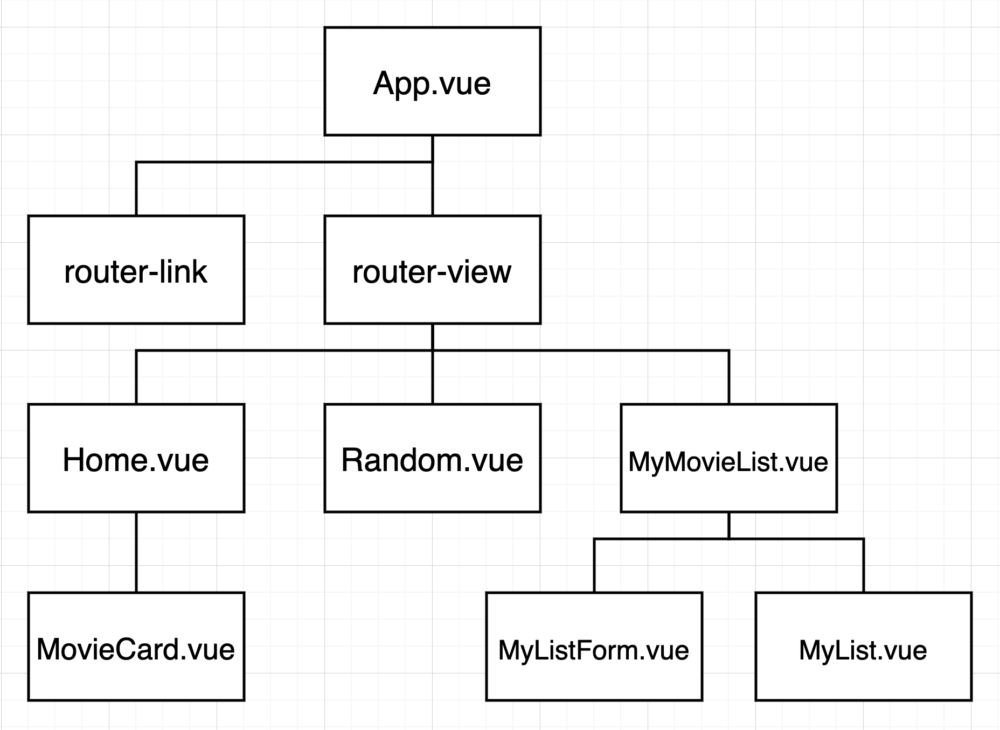

# README


## 0. 기술스택


## 1. 서비스 및 주요 기능 소개

- 영화 정보를 제공하는 SPA
- AJAX 통신
- vuex,vue-router 활용

---




​												   					  **[ 데모 화면 ]**

## 2. 배운점 / 문제 해결 과정 

- bootstrap  & Font Awesome적용 

  - public>index.html

  ```html
  <!DOCTYPE html>
  <html lang="en">
  		....
      <script src="https://kit.fontawesome.com/dacf7dcd9c.js" crossorigin="anonymous"></script>
  
      <link rel="icon" href="<%= BASE_URL %>favicon.ico">
      <title><%= htmlWebpackPlugin.options.title %></title>
    </head>
    <body>
      <script src="https://code.jquery.com/jquery-3.5.1.slim.min.js" integrity="sha384-DfXdz2htPH0lsSSs5nCTpuj/zy4C+OGpamoFVy38MVBnE+IbbVYUew+OrCXaRkfj" crossorigin="anonymous"></script>
      <script src="https://cdn.jsdelivr.net/npm/bootstrap@4.5.3/dist/js/bootstrap.bundle.min.js" integrity="sha384-ho+j7jyWK8fNQe+A12Hb8AhRq26LrZ/JpcUGGOn+Y7RsweNrtN/tE3MoK7ZeZDyx" crossorigin="anonymous"></script>
  		....
        
  </html>
  
  ```

  

- Vuex

  - npm install vuex -> vue add vuex  

    1. `State`

       https://vuex.vuejs.org/kr/guide/state.html

       - `Mutations`에 정의된 메서드에 의해 변경
       - 중앙에서 관리하는 모든 상태 정보 즉, data를 의미한다.
       - '중앙 집중식 관리'라는 건 Vue.js로 만든 서비스에 내부에 존재하는 모든 상태를 '한 곳'에 모아서 관리하는 것을 의미한다.
       - 이전의 방식은 state를 찾기 위해 각 컴포넌트를 하나 하나 살펴봐야 했다면, Vuex를 활용하는 방식은 Store에서 관리하는 데이터에를 통해 state를 한 눈에 파악할 수 있다.
       - (그리고 여전히) state가 변화하면 해당 state 정보를 공유한 컴포넌트의 DOM은 Re-rendering된다.

    2. `Actions`

       https://vuex.vuejs.org/kr/guide/actions.html

       - *Vue Components에서 `dispatch`메서드에 의해 호출된다.*
       - Backend API와 통신하여 data fetching 등의 작업을 수행한다.
         - 이 과정에서 동기적인 작업 뿐만 아니라 비동기적인 작업을 포함할 수 있다.
         - state를 변경하지 않는 건 비동기적인 작업 과정에서 state의 상태가 예상하는 것과 다를 수 있기 때문이다.
       - 항상 `context` 가 인자로 넘어온다.
         - 이름이 `context` 이유는 해당 객체는 모든 Vuex 요소에 접근할 수 있기 때문이다.
         - 즉, (우리가 작성 할 코드에서) `store.js` 파일 내에 있는 모든 요소에 접근해서 속성 접근 & 메서드 호출이 가능하다.
       - 단, (가능하지만) state를 직접 변경하지 않는다.
         - mutations에 정의된 메서드를 `commit` 메서드로 호출한다.
         - state는 오로지 mutations 메서드를 통해서만 조작한다.
         - 명확한 역할 분담을 통해 서비스 규모가 커져도 state를 올바르게 관리하기 위함이다.

    3. `Mutations`

       https://vuex.vuejs.org/kr/guide/mutations.html

       - *Actions에서 `commit`메서드에 의해 호출된다.*
       - state를 변경한다. 때문에 mutations에 정의하는 메서드의 첫 번째 인자로 state가 넘어온다.
       - (가장 핵심이 되는) state를 변경하는 로직이 담기기 때문에 '동기적'인 코드만 작성한다.
         - 직관적으로 state가 어떻게 변경되는지 알 수 있다.
         - 이때 비동기적 로직이 수행되면 State가 변화하는 시점이 달라질 수 있기 때문에 관리가 불가능하다.

    4. `Getters`

       https://vuex.vuejs.org/kr/guide/getters.html

       - state를 변경하지 않고 활용하여 계산을 수행하는 로직이 들어간다. 첫 번째 인자로 state가 넘어온다.
       - Vue의 computed와 거의 동일하다.
         - 실제 계산된 값을 사용하는 것처럼 getters는 저장소의 상태(state)를 기준으로 계산한다.
           - 예를 들어, state에 todo list의 해야 할 일의 목록이 있다고 생각해보자. todo가 완료된 목록만 filtering해서 보여줘야 하는 경우 getters에서 `.filter` array helper를 사용해 `completed`의 값이 `true`인 요소가 필터링 해서 계산된 값을 담아 놓는다.
           - 혹은 우리가 활용한 예시처럼 모든 todos의 개수 및 필터링이 된 요소의 개수 등을 파악할 수 있다.
       - 여기서 핵심은 getters 자체가 state를 '변경'하는 것이 아니다.
         - 단순하게 state를 특정한 조건에 따라 구분(계산)한다.
         - 계산된 값을 '가져온다(get)' 정도로 이해해보자/

    5. `modules`

       https://vuex.vuejs.org/kr/guide/modules.html

       - Vuex 내부의 요소가 커졌을 때 이를 다시 모듈화 할 때 사용한다.

```javascript
// views폴더 안에 라우터 MyMovie
// import => 등록 => 호출
<template>
  <div>
    <h2>MyMovieList</h2>
    <MyListForm /> 
    <!--3. 호출 -->
    <MyList />
  </div>
</template>

<script>
import MyListForm from '@/components/MyListForm'
import MyList from '@/components/MyList' 
//1. 불러오기

export default {
  name: 'MyMovieList',

  components: { //2. 등록
    MyListForm,
    MyList
  }
```

- MyListForm.vue
  - 입력을 등록하고 store에 `dispatch` -> 

```javascript
import Vue from 'vue'
import Vuex from 'vuex'

Vue.use(Vuex)

export default new Vuex.Store({
  state: { // 데이터 저장
    movieList :[]
  },
  mutations: {
    CREATE_LIST(state, movie){
        // 2. 데이터 변화 
      state.movieList.push(movie)
    }
  },
  actions: {
      //1. 함수 호출 
    createList({commit}, movie){
      commit('CREATE_LIST', movie)
    }
  },
  modules: {
  }
})

```

---

#### 🐱‍🚀배운점

- Vuex를 공부했었는데 복습을 소홀히하면서 기억이 바로나지 못했다. 간단하지만 다시 구현해보면서 상기시킬수 있었다.  

- props & emit을 통한 데이터 주고 받는 방식과 Vuex를 같이 해보면서 둘의 매커니즘을 상기시키는 동시에 왜 써야하는지 어떠한 상황에서 쓰면 좋을지 생각하는 시간이었다. 

